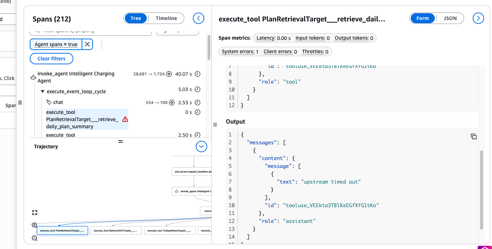

# AWS Fault Injection Service Experiment: Strands Agent Tool-Level Chaos on Amazon Bedrock AgentCore

This is an experiment template for use with AWS Fault Injection Service (FIS) and fis-template-library-tooling. This experiment template requires deployment into your AWS account and requires a Strands agent deployed to Amazon Bedrock AgentCore Runtime to inject faults into. Faults are injected at the tool level (cancelled or corrupted tool results) and toggled per invocation via AWS Systems Manager (SSM) Parameter Store — no agent redeploy, no `UpdateAgentRuntime`, no session draining.

THIS TEMPLATE WILL INJECT REAL FAULTS! THE SOFTWARE IS PROVIDED "AS IS", WITHOUT WARRANTY OF ANY KIND, EXPRESS OR IMPLIED, INCLUDING BUT NOT LIMITED TO THE WARRANTIES OF MERCHANTABILITY, FITNESS FOR A PARTICULAR PURPOSE AND NONINFRINGEMENT. IN NO EVENT SHALL THE AUTHORS OR COPYRIGHT
HOLDERS BE LIABLE FOR ANY CLAIM, DAMAGES OR OTHER LIABILITY, WHETHER IN AN ACTION
OF CONTRACT, TORT OR OTHERWISE, ARISING FROM, OUT OF OR IN CONNECTION WITH THE
SOFTWARE OR THE USE OR OTHER DEALINGS IN THE SOFTWARE

## Description

Unlike the other experiments in this library, which impair an AWS resource (an EC2 instance, an SQS queue, an Aurora cluster), this experiment injects faults at the boundary between an AI agent's reasoning and the tools it calls. An AI agent that receives a failed or corrupted tool result does not crash — it may retry, fall back, fail safe, or fabricate a plausible-but-wrong answer. This experiment lets you find out which, before a real impairment does.

It ships one extra artifact the resource-based experiments do not: a small Python module (`strands_agentcore_chaos.py`) that you vendor into your agent build and wire in with a single line, `plugins=chaos_plugins()`. That module reads the `/chaos/{runtime_id}/*` parameters this experiment writes and injects the configured faults per invocation. Every invocation is a clean no-op until an FIS experiment sets `active=true`, and a production build simply omits the module.

## Hypothesis

When tool calls made by a Strands agent are **cancelled** (`timeout`, `network_error`, `execution_error`, `validation_error`) or its tool results are **corrupted** (`truncate_fields`, `remove_fields`, `corrupt_values`), the agent will detect that a trustworthy result is unavailable and **fail safe** — acknowledge that it cannot complete the task, return a caveated or partial answer, or escalate — rather than fabricate a result from missing data. Raw errors will not be surfaced to the user. Other unfaulted user journeys on the same workload will continue unaffected, and when the fault is removed the agent will return to steady state within the parameter cache TTL.

## Prerequisites

Before running this experiment, ensure that:

1. You have the necessary permissions to execute the FIS experiment and to start SSM Automation executions.
2. A Strands agent integrated with `plugins=chaos_plugins()` (using the included `strands_agentcore_chaos.py`) is built and deployed to a **dedicated chaos** Amazon Bedrock AgentCore Runtime, separate from production.
3. You know the runtime ID of that chaos runtime; it scopes the `/chaos/{runtime_id}/` parameter subtree and must equal the value the chaos build resolves via `resolve_runtime_id`.
4. The following IAM roles exist:
   - An FIS experiment role (`ChaosExperiment-FIS-Role`) trusted by `fis.amazonaws.com`, with permission to start the SSM Automation (policy and trust in `agentcore-strands-agent-faults-fis-role-iam-policy.json` / `fis-iam-trust-relationship.json`).
   - An SSM Automation role (`ChaosExperiment-SSM-Automation-Role`) with `ssm:PutParameter` and `ssm:DeleteParameters` on `/chaos/*` (policy and trust in `agentcore-strands-agent-faults-ssm-automation-role-iam-policy.json` / `ssm-iam-trust-relationship.json`).
   - The chaos-build runtime execution role with `ssm:GetParametersByPath` on `/chaos/*` (fragment in `agentcore-strands-agent-faults-runtime-exec-role-iam-policy.json`).
5. The SSM Automation document (`agentcore-strands-agent-faults-automation.yaml`) is deployed to your account as `ChaosExperiment`.

Throughout the artifacts, replace the placeholders `<YOUR REGION>` and `<YOUR AWS ACCOUNT>` with your values, and set the `RuntimeId` document parameter to your chaos runtime ID before running.

## How it works

FIS runs a single `aws:ssm:start-automation-execution` action, which invokes the `ChaosExperiment` SSM Automation document:

1. **Enable** — the document writes `fault_rate`, `fault_injections`, and `execution_id` to `/chaos/{runtime_id}/`, then sets `active=true` **last**, so no invocation ever observes a half-written config.
2. **Hold** — chaos stays active for `DurationSeconds`. On each invocation the agent's `RuntimeChaosController` reads the TTL-cached config, samples `random() < fault_rate`, and on selection applies the whole `fault_injections` map for that invocation.
3. **Disable** — the document sets `active=false` **first** (the off switch), waits for the cache TTL, then deletes all four parameters.
4. **Rollback** — the disable step is wired as `onCancel`/`onFailure`, so if a stop-condition alarm trips, FIS cancels the execution, writes `active=false`, and cleans up.

`fault_rate` decides *whether* an invocation is faulted; `fault_injections` (a JSON map of tool → one effect) decides *what*. Malformed JSON, an unknown `effect_type`, more than one effect per tool, or an out-of-range `fault_rate` all fail closed to a no-op — a misconfiguration can only ever produce less chaos, never more.

### Supported effect types

**Pre-hook** effects cancel the tool call before it executes: `timeout`, `network_error`, `execution_error`, `validation_error` (each returns a configurable `error_message`). **Post-hook** effects corrupt the tool's response after it runs: `truncate_fields` (`max_length`, default 10), `remove_fields` (`remove_ratio`, default 0.5), `corrupt_values` (`corrupt_ratio`, default 0.5). The upstream effect definitions in `strands_evals.chaos.effects` are authoritative; new effect types are picked up automatically.

## Stop Conditions

The experiment does not have any specific stop conditions defined. It will continue to run until manually stopped or until the configured `DurationSeconds` elapses and the document cleanly disables chaos.

## Observability and stop conditions

Stop conditions are based on an AWS CloudWatch alarm based on an operational or
business metric requiring an immediate end of the fault injection. This
template makes no assumptions about your application and the relevant metrics
and does not include stop conditions by default.

Because a tool-level fault that the agent handles gracefully completes as a successful invocation, it is invisible to infrastructure error metrics. Surface the agent's own signal instead: the controller logs an activation line at `INFO` (`activated chaos execution=<...> tools=<...>`) — set `logging.getLogger("strands_agentcore_chaos").setLevel(logging.INFO)` in your build, and consider a CloudWatch Logs metric filter on `activated chaos` so you can alarm on and graph the fault. The `execution_id` parameter (the SSM Automation execution ID) correlates CloudWatch Logs, CloudTrail, and FIS entries for a single run.

## Next Steps

As you adapt this scenario to your needs, we recommend:

1. Reviewing the runtime ID and parameter path to ensure they scope to your dedicated chaos runtime and not production.
2. Identifying business metrics tied to your agent (task-success rate, response-quality score, downstream action correctness) rather than infrastructure error rates.
3. Creating an Amazon CloudWatch metric and Amazon CloudWatch alarm to monitor the impact of the injected faults on those business metrics.
4. Adding a stop condition tied to the alarm to automatically halt the experiment if critical thresholds are breached.
5. Starting with a low `fault_rate` (for example 0.05–0.1) and a single benign effect such as `timeout`, then escalating to `corrupt_values` and multiple tools; and confirming your production build omits `strands_agentcore_chaos` and has no `/chaos/*` access.

## Import Experiment
You can import the json experiment template into your AWS account via cli or aws cdk. For step by step instructions on how, [click here](https://github.com/aws-samples/fis-template-library-tooling).
