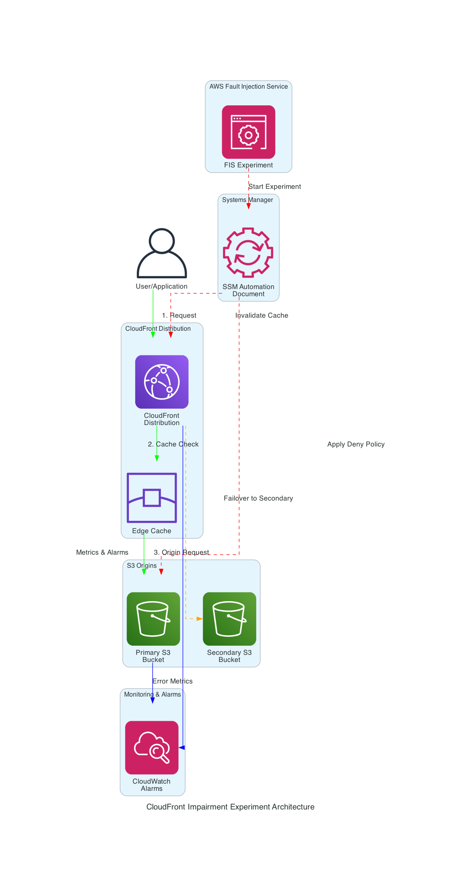
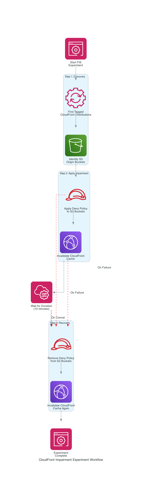

# AWS Fault Injection Service Experiment: CloudFront Distribution Impairment

This is an experiment template for use with AWS Fault Injection Service (FIS) and fis-template-library-tooling. This experiment template requires deployment into your AWS account and requires resources in your AWS account to inject faults into.

⚠️ **THIS TEMPLATE WILL INJECT REAL FAULTS!** THE SOFTWARE IS PROVIDED "AS IS", WITHOUT WARRANTY OF ANY KIND, EXPRESS OR IMPLIED, INCLUDING BUT NOT LIMITED TO THE WARRANTIES OF MERCHANTABILITY, FITNESS FOR A PARTICULAR PURPOSE AND NONINFRINGEMENT. IN NO EVENT SHALL THE AUTHORS OR COPYRIGHT HOLDERS BE LIABLE FOR ANY CLAIM, DAMAGES OR OTHER LIABILITY, WHETHER IN AN ACTION OF CONTRACT, TORT OR OTHERWISE, ARISING FROM, OUT OF OR IN CONNECTION WITH THE SOFTWARE OR THE USE OR OTHER DEALINGS IN THE SOFTWARE.

## Architecture Overview



This experiment simulates CloudFront origin failures by temporarily blocking access to S3 buckets that serve as CloudFront origins, forcing failover to secondary origins or exposing gaps in your resilience strategy.

## Example Hypothesis

When S3 origins serving CloudFront distributions are experiencing an impairment, CloudFront should automatically failover to secondary origins within 30 seconds. An alarm should be raised and the DevOps team notified within 2-3 minutes. Content delivery should continue seamlessly through the failover origin. Once the primary origin impairment is resolved, CloudFront should resume using the primary origin within 30 seconds.

### What does this enable me to verify?

* Appropriate customer experience metrics and observability of CloudFront is in place (were you able to detect there was a problem?)
* Alarms are configured correctly (were the right people notified and/or automations triggered?)
* Your app gracefully degrades when CDN is unavailable
* Your circuit breaker (if any) works as expected for CDN failures
* Recovery controls (if any) work as expected

## Prerequisites

Before running this experiment, ensure that:

1. You have the roles created for FIS and SSM Automation to use. Example IAM policy documents and trust policies are provided.
2. You have created the SSM Automation Document from the sample provided (cloudfront-impairment-tag-based-automation.yaml)
3. You have created the FIS Experiment Template from the sample provided (cloudfront-impairment-tag-based-template.json)
4. The CloudFront distribution(s) you want to target have the "FIS-Ready":"True" tag and value
5. **Your CloudFront distributions must have origin groups configured** with primary and secondary origins
6. The S3 buckets used as origins should also be tagged appropriately for the IAM conditions to work
7. You have appropriate monitoring and observability in place to track the impact of the experiment.

### 3. FIS Experiment Template
- Create the FIS Experiment Template from `cloudfront-impairment-tag-based-experiment-template.json`
- Update the `roleArn` with your FIS role ARN
- Update the `documentArn` in the automation parameters

### 4. Resource Tagging
- Tag your CloudFront distributions with `FIS-Ready: True`
- Ensure S3 buckets used as origins are accessible by the SSM Automation role

### 5. Monitoring Setup
- Configure CloudWatch alarms for CloudFront metrics (error rates, origin latency)
- Set up application-level monitoring to detect service degradation
- Consider implementing stop conditions based on critical business metrics

### 6. Backup and Recovery
- Ensure you have secondary origins configured (optional but recommended)
- Test your application's behavior when CloudFront origins are unavailable
- Have rollback procedures documented

## How it works

This experiment simulates CloudFront origin impairment by applying deny policies to S3 buckets used as origins in CloudFront distributions. The experiment runs for 10 minutes by default.



### Experiment Steps

1. **Discovery Phase**: 
   - Identifies CloudFront distributions tagged with `FIS-Ready: True`
   - Extracts S3 bucket names used as origins in these distributions

2. **Impairment Phase**:
   - Applies a temporary deny-all policy to identified S3 buckets
   - Invalidates CloudFront cache to force immediate origin requests
   - This triggers failover to secondary origins (if configured) or exposes service degradation

3. **Wait Phase**: 
   - Maintains impairment for the specified duration (default: 10 minutes)
   - Allows time to observe system behavior and response

4. **Recovery Phase**:
   - Removes the deny policy from all affected S3 buckets
   - Invalidates CloudFront cache again to restore normal operation
   - System should return to normal functionality

### Testing the Experiment

To verify the experiment is working properly, monitor your CloudFront distribution:

```bash
# Monitor HTTP response codes
watch -n 5 'curl -I https://<YOUR-CLOUDFRONT-DOMAIN>.cloudfront.net'

# Monitor with detailed timing
watch -n 5 'curl -w "@curl-format.txt" -o /dev/null -s https://<YOUR-CLOUDFRONT-DOMAIN>.cloudfront.net'
```

Create a `curl-format.txt` file with:
```
     time_namelookup:  %{time_namelookup}\n
        time_connect:  %{time_connect}\n
     time_appconnect:  %{time_appconnect}\n
    time_pretransfer:  %{time_pretransfer}\n
       time_redirect:  %{time_redirect}\n
  time_starttransfer:  %{time_starttransfer}\n
                     ----------\n
          time_total:  %{time_total}\n
         http_code:   %{http_code}\n
```

During the impairment period, you should observe:
- Increased response times or errors if no secondary origin is configured
- Successful failover to secondary origins (if properly configured)
- CloudWatch alarms triggering (if monitoring is in place)

## Stop Conditions

The experiment does not have any specific stop conditions defined. It will continue to run until all actions are completed or until manually stopped.

## Observability and stop conditions

Stop conditions are based on an AWS CloudWatch alarm based on an operational or business metric requiring an immediate end of the fault injection. This template makes no assumptions about your application and the relevant metrics and does not include stop conditions by default.

## Customization and Best Practices

### Experiment Customization

1. **Duration**: Modify the `duration` parameter in the experiment template (default: `PT10M` = 10 minutes)
2. **Targeting**: Update tag keys/values to match your tagging strategy
3. **Stop Conditions**: Add CloudWatch alarms as stop conditions to automatically halt the experiment if critical thresholds are breached

### Recommended Monitoring

Set up the following CloudWatch alarms before running the experiment:

```bash
# CloudFront Error Rate
aws cloudwatch put-metric-alarm \
  --alarm-name "CloudFront-HighErrorRate" \
  --alarm-description "CloudFront error rate above 5%" \
  --metric-name "4xxErrorRate" \
  --namespace "AWS/CloudFront" \
  --statistic "Average" \
  --period 300 \
  --threshold 5.0 \
  --comparison-operator "GreaterThanThreshold"

# Origin Response Time
aws cloudwatch put-metric-alarm \
  --alarm-name "CloudFront-HighOriginLatency" \
  --alarm-description "CloudFront origin latency above 5 seconds" \
  --metric-name "OriginLatency" \
  --namespace "AWS/CloudFront" \
  --statistic "Average" \
  --period 300 \
  --threshold 5000 \
  --comparison-operator "GreaterThanThreshold"
```

### Next Steps

1. **Test in Non-Production**: Always test in a development or staging environment first
2. **Gradual Rollout**: Start with shorter durations and less critical distributions
3. **Document Findings**: Record observations about system behavior and recovery times
4. **Update Runbooks**: Incorporate learnings into incident response procedures
5. **Implement Improvements**: Based on experiment results, enhance your resilience mechanisms

### Common Scenarios to Test

- **No Secondary Origin**: Observe how your application handles complete CloudFront origin failure
- **Secondary Origin Configured**: Verify failover mechanisms work as expected
- **Partial Failure**: Test with only some origins impaired to simulate partial outages
- **Recovery Time**: Measure how long it takes for normal service to resume after the experiment

## Troubleshooting

### Common Issues

**Experiment fails to find CloudFront distributions:**
- Verify distributions are tagged with `FIS-Ready: True`
- Check that the SSM Automation role has permissions to list CloudFront distributions
- Ensure you're running in the correct AWS region

**S3 policy application fails:**
- Verify the SSM Automation role has `s3:GetBucketPolicy` and `s3:PutBucketPolicy` permissions
- Check that S3 bucket names are correctly extracted from CloudFront origins
- Ensure buckets exist and are accessible

**Cache invalidation fails:**
- Verify the SSM Automation role has `cloudfront:CreateInvalidation` permissions
- Check CloudFront distribution IDs are valid
- Monitor CloudFront invalidation limits (you can have up to 3,000 invalidation requests in progress)

**Experiment doesn't restore properly:**
- The automation includes error handling to remove deny policies even if the experiment fails
- Manually check S3 bucket policies for any remaining `FISTemporaryDeny` statements
- Manually invalidate CloudFront cache if needed

### Manual Recovery

If the experiment fails to restore automatically:

```bash
# Remove deny policy manually
aws s3api delete-bucket-policy --bucket YOUR-BUCKET-NAME

# Or remove just the FIS statement
aws s3api get-bucket-policy --bucket YOUR-BUCKET-NAME --query Policy --output text | \
  jq 'del(.Statement[] | select(.Sid == "FISTemporaryDeny"))' | \
  aws s3api put-bucket-policy --bucket YOUR-BUCKET-NAME --policy file:///dev/stdin

# Invalidate CloudFront cache
aws cloudfront create-invalidation \
  --distribution-id YOUR-DISTRIBUTION-ID \
  --invalidation-batch "Paths={Quantity=1,Items=['/*']},CallerReference=$(date +%s)"
```

## Import Experiment

You can import the json experiment template into your AWS account via CLI or AWS CDK. For step-by-step instructions, [click here](https://github.com/aws-samples/fis-template-library-tooling).

## Files in this Template

- `cloudfront-impairment-tag-based-experiment-template.json` - FIS experiment template
- `cloudfront-impairment-tag-based-automation.yaml` - SSM Automation Document
- `cloudfront-impairment-tag-based-fis-role-iam-policy.json` - IAM policy for FIS role
- `cloudfront-impairment-tag-based-ssm-automation-role-iam-policy.json` - IAM policy for SSM role
- `fis-iam-trust-relationship.json` - Trust policy for FIS role
- `ssm-iam-trust-relationship.json` - Trust policy for SSM role
