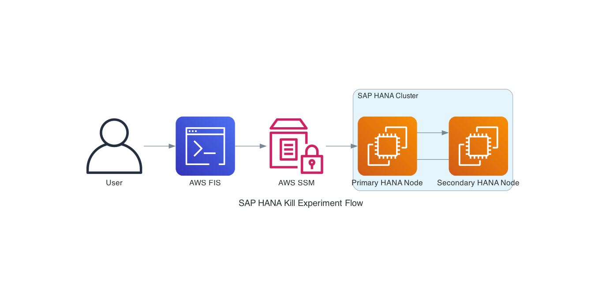

# SAP HANA Database Process Kill Experiment

This experiment simulates a failure of SAP HANA database processes using the `HDB kill-9` command. It's designed to test the resilience of your SAP HANA database and the effectiveness of your high availability setup.

## Hypothesis

When all SAP HANA processes are terminated on the primary database node, the cluster's high availability mechanisms will detect the failure and automatically promote the secondary node to primary, ensuring continuous database availability with minimal disruption to applications.



## Overview

The experiment uses AWS Fault Injection Simulator (FIS) to execute an SSM document that kills all SAP HANA processes on target instances. This allows you to:

- Test how your SAP system responds to sudden database process failures
- Validate your high availability configuration and failover mechanisms
- Verify monitoring and alerting systems for database failures
- Practice recovery procedures in a controlled environment

## Prerequisites

- AWS account with appropriate permissions to use FIS and SSM
- SAP HANA database running on EC2 instances
- EC2 instances must have the SSM agent installed and running
- Target instances must be tagged with:
  - `FIS-Ready: True`
  - `FIS-SAP-Tier: DB`
- IAM role with necessary permissions for FIS to execute SSM commands

## Experiment Parameters

The experiment can be customized with the following parameter:

- `Sid`: SAP HANA System ID (SID)

## How It Works

The experiment follows these steps:

1. **Validation**: Verifies prerequisites and identifies the SAP HANA installation path
2. **Pre-Experiment Recording**: Captures the current state of HANA processes and cluster information
3. **Process Termination**: Executes `HDB kill-9` to terminate all HANA processes
4. **Verification**: Confirms processes were terminated and records cluster status
5. **Cleanup**: Removes temporary files and provides experiment summary

## Running the Experiment

You can run the experiment using the AWS Management Console or AWS CLI:

```bash
aws fis start-experiment --experiment-template-id SAP-HANA-Kill-Experiment
```

## Safety Considerations

- Always run this experiment in a test environment first
- Consider adding CloudWatch alarms as stop conditions
- Monitor your SAP system closely during the experiment
- Have a rollback plan ready in case of unexpected issues
- Ensure your team is aware of the experiment and ready to respond

## Expected Outcomes

When the experiment runs successfully:

1. All SAP HANA processes will be terminated on the target instance
2. If you have proper high availability configured, a failover should occur
3. Your monitoring systems should detect the failure and alert
4. Recovery procedures should be triggered automatically or manually

## Cluster Information

The experiment captures cluster information using `crm_mon -A1 --output-as text` at two points:
- Before killing the processes
- After the experiment completes

This information is valuable for understanding how your cluster responds to the failure.

## Observability and Stop Conditions

Stop conditions are based on an AWS CloudWatch alarm based on an operational or business metric requiring an immediate end of the fault injection. This template makes no assumptions about your application and the relevant metrics and does not include stop conditions by default.

## Next Steps

As you adapt this scenario to your needs, we recommend:
1. Reviewing the tag names you use to ensure they fit your specific use case
2. Identifying business metrics tied to the SAP HANA service availability
3. Creating an Amazon CloudWatch metric and Amazon CloudWatch alarm to monitor the impact of killing HANA processes
4. Adding a stop condition tied to the alarm to automatically halt the experiment if critical thresholds are breached
5. Implementing proper logging and monitoring to track the behavior of your application when HANA processes are killed

## Troubleshooting

If the experiment fails to run:

- Check that your target instances are properly tagged
- Verify that the SSM agent is running on the target instances
- Ensure the IAM role has the necessary permissions
- Review the SSM command execution logs for errors

## Additional Resources

- [AWS Fault Injection Simulator Documentation](https://docs.aws.amazon.com/fis/latest/userguide/what-is.html)
- [SAP HANA High Availability Guide](https://help.sap.com/docs/SAP_HANA_PLATFORM/6b94445c94ae495c83a19646e7c3fd56/0ba8d758dcca4bd7a8fd220bd0afc3d5.html)
- [AWS Systems Manager Documentation](https://docs.aws.amazon.com/systems-manager/latest/userguide/what-is-systems-manager.html)
