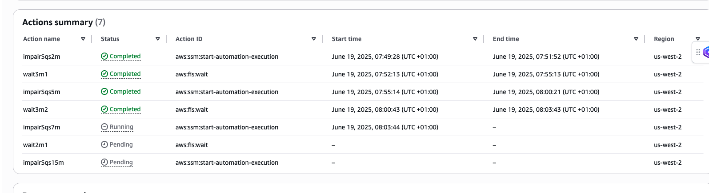

# AWS Fault Injection Service Experiment: SQS Queue Impairment

This is an experiment template for use with AWS Fault Injection Service (FIS) and fis-template-library-tooling. This experiment template requires deployment into your AWS account and requires resources in your AWS account to inject faults into.

THIS TEMPLATE WILL INJECT REAL FAULTS! THE SOFTWARE IS PROVIDED "AS IS", WITHOUT WARRANTY OF ANY KIND, EXPRESS OR IMPLIED, INCLUDING BUT NOT LIMITED TO THE WARRANTIES OF MERCHANTABILITY, FITNESS FOR A PARTICULAR PURPOSE AND NONINFRINGEMENT. IN NO EVENT SHALL THE AUTHORS OR COPYRIGHT HOLDERS BE LIABLE FOR ANY CLAIM, DAMAGES OR OTHER LIABILITY, WHETHER IN AN ACTION OF CONTRACT, TORT OR OTHERWISE, ARISING FROM, OUT OF OR IN CONNECTION WITH THE SOFTWARE OR THE USE OR OTHER DEALINGS IN THE SOFTWARE.

## Hypothesis

When the SQS service is experiencing an impairment in a region which impacts my application, an alarm should be raised and the DevOps team notified within 5 minutes. Functionality relating to dependent components should not be available to end users during the impairment; however, independent components should continue to operate normally. Once the SQS impairment has been resolved, dependent components should become available to end users within 5 minutes.

## Prerequisites

Before running this experiment, ensure that:

1. You have the necessary permissions to execute the FIS experiment and perform SQS policy modifications.
2. The IAM role specified in the `roleArn` field has the required permissions to perform SSM automation and Lambda invocation.
3. The SQS queue you want to target has the `Purpose=resilience-testing` tag.
4. You have deployed the SSM Automation Document and Lambda function that will modify the SQS queue policy.
5. You have appropriate monitoring and observability in place to track the impact of the experiment.
6. You have tested this experiment in a non-production environment first.

## How it works

This experiment simulates a worsening impairment of an SQS queue by applying a deny-all policy that blocks access to the queue for increasing durations. The experiment follows this sequence:

1. First impairment: Blocks access to the SQS queue for 2 minutes
2. Wait period: 3 minutes of normal operation
3. Second impairment: Blocks access to the SQS queue for 5 minutes
4. Wait period: 3 minutes of normal operation
5. Third impairment: Blocks access to the SQS queue for 7 minutes
6. Wait period: 2 minutes of normal operation
7. Fourth impairment: Blocks access to the SQS queue for 15 minutes

The impairment is implemented using an SSM Automation Document that invokes a Lambda function. The Lambda function adds a deny statement to the SQS queue policy that prevents all principals from performing key operations like sending and receiving messages. After the specified duration, the Lambda function removes the deny statement, restoring normal access to the queue.

To observe the impact of the experiment, you can monitor your application's behavior or use the AWS CLI to attempt operations on the queue:

```bash
watch -n 5 'aws sqs send-message --queue-url "https://sqs.<YOUR REGION>.amazonaws.com/<YOUR AWS ACCOUNT>/<YOUR SQS QUEUE>" --message-body "This is a test message" --region <YOUR REGION> --no-cli-pager'
```

During the impairment periods, you should see "access denied" errors when attempting to send or receive messages from the queue.



## Stop Conditions

The experiment does not have any specific stop conditions defined. It will continue to run until all actions are completed or until manually stopped.

## Observability and stop conditions

Stop conditions are based on an AWS CloudWatch alarm based on an operational or business metric requiring an immediate end of the fault injection. This template makes no assumptions about your application and the relevant metrics and does not include stop conditions by default.

## Next Steps

As you adapt this scenario to your needs, we recommend:

1. Reviewing the tag names you use to ensure they fit your specific use case.
2. Identifying business metrics tied to your SQS queue processing, such as message throughput or application transaction rates.
3. Creating an Amazon CloudWatch metric and Amazon CloudWatch alarm to monitor the impact of the SQS impairment.
4. Adding a stop condition tied to the alarm to automatically halt the experiment if critical thresholds are breached.
5. Implementing appropriate circuit breakers in your application to handle SQS service impairments gracefully.
6. Testing your application's recovery mechanisms to ensure they work as expected after the SQS service is restored.
7. Documenting the findings from your experiment and updating your incident response procedures accordingly.

## Import Experiment

You can import the json experiment template into your AWS account via cli or aws cdk. For step by step instructions on how, [click here](https://github.com/aws-samples/fis-template-library-tooling).
