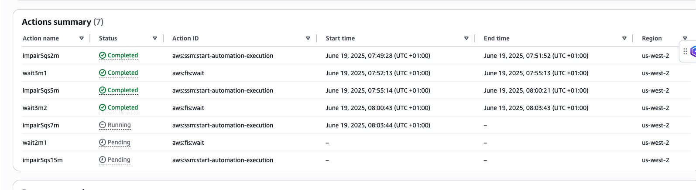

# AWS Fault Injection Service Experiment: SQS Queue Impairment

This is an experiment template for use with AWS Fault Injection Service (FIS) and fis-template-library-tooling. This experiment template requires deployment into your AWS account and requires resources in your AWS account to inject faults into.

THIS TEMPLATE WILL INJECT REAL FAULTS! THE SOFTWARE IS PROVIDED "AS IS", WITHOUT WARRANTY OF ANY KIND, EXPRESS OR IMPLIED, INCLUDING BUT NOT LIMITED TO THE WARRANTIES OF MERCHANTABILITY, FITNESS FOR A PARTICULAR PURPOSE AND NONINFRINGEMENT. IN NO EVENT SHALL THE AUTHORS OR COPYRIGHT HOLDERS BE LIABLE FOR ANY CLAIM, DAMAGES OR OTHER LIABILITY, WHETHER IN AN ACTION OF CONTRACT, TORT OR OTHERWISE, ARISING FROM, OUT OF OR IN CONNECTION WITH THE SOFTWARE OR THE USE OR OTHER DEALINGS IN THE SOFTWARE.

## Example Hypothesis

When the SQS service is experiencing an impairment in a region which impacts my application, an alarm should be raised and the DevOps team notified within 5 minutes. Functionality relating to component A should not be available to end users during the impairment; however, other components should continue to operate normally. Once the SQS impairment has been resolved, component A should become available to end users within 5 minutes.

### What does this enable me to verify?

* Appropriate customer experience metrics and observability of SQS is in place (were you able to detect there was a problem?)
* Alarms are configured correctly (were the right people notified at the right time and/or automations triggered?)
* Your app gracefully degrades and customers aren't submitting transactions which you know will fail
* Your circuit breaker (if any) works as expected
* Recovery controls (if any) work as expected

## Prerequisites

Before running this experiment, ensure that:

1. You have the roles created for FIS and SSM Automation to use. Example IAM policy documents and trust policies are provided.
2. You have created the SSM Automation Document from the sample provided (sqs-queue-impairment-tag-based-automation.yaml)
3. You have created the FIS Experiment Template from the sample provided (sqs-queue-impairment-tag-based-template.json)
3. The SQS queue(s) you want to target have the "FIS-Ready":"True" tag and value
5. You have appropriate monitoring and observability in place to track the impact of the experiment.

## How it works

This experiment simulates a worsening impairment of an SQS queue by applying a deny-all policy that blocks access to the queue for increasing durations. The experiment follows this sequence:

1. First impairment: Blocks access to the SQS queue for 2 minutes
2. Wait period: 3 minutes of normal operation
3. Second impairment: Blocks access to the SQS queue for 5 minutes
4. Wait period: 3 minutes of normal operation
5. Third impairment: Blocks access to the SQS queue for 7 minutes
6. Wait period: 2 minutes of normal operation
7. Fourth impairment: Blocks access to the SQS queue for 15 minutes

The impairment is implemented using an SSM Automation Document invoked by FIS. The SSM Automation Document adds a deny statement to the SQS queue policy that blocks data-plane operations like sending and receiving messages. After the specified duration, the Automation Document removes the deny statement, restoring normal access to the queue.

By default the deny applies to all principals (`Principal: "*"`), simulating a full service partition. To impair only your application — and leave admins, monitoring, and other consumers of the queue unaffected — set the optional `targetPrincipalArn` parameter to the application's IAM role ARN; the deny is then scoped to that principal. The deny covers only data-plane actions (`SendMessage`, `ReceiveMessage`, `DeleteMessage`, `ChangeMessageVisibility`, `PurgeQueue`) and never queue-management actions, so the automation (and your admins) can always remove it.

To verify the experiment is setup and working properly, you can use the AWS CLI to attempt operations on a targeted SQS queue:

```bash
watch -n 5 'aws sqs send-message --queue-url "https://sqs.<YOUR REGION>.amazonaws.com/<YOUR AWS ACCOUNT>/<YOUR SQS QUEUE>" --message-body "This is a test message" --region <YOUR REGION> --no-cli-pager'
```

During the impairment periods, you should see "AccessDenied" errors when attempting to send or receive messages from the queue.



## Observability and stop conditions

Stop conditions are based on an AWS CloudWatch alarm tied to an operational or business metric requiring an immediate end of the fault injection. This template makes no assumptions about your application and the relevant metrics, so it does not include stop conditions by default (`"stopConditions": [{ "source": "none" }]`).

**Choose the stop-condition metric carefully.** Do *not* alarm on the queue metrics this experiment perturbs (`ApproximateAgeOfOldestMessage`, `NumberOfMessagesSent`, `ApproximateNumberOfMessagesVisible` on the source queue). Those are expected to move during impairment, so an alarm on them would abort the experiment during the first short phase — before the longer phases surface the failure modes you care about. Instead, alarm on a signal that should stay healthy if your resilience works, i.e. real customer/business impact:

* An application error-rate or transaction-success metric your app emits (best — directly measures customer impact).
* Load balancer 5xx count or target response time (a good proxy if you don't yet emit a business metric).
* Dead-letter queue depth (`ApproximateNumberOfMessagesVisible` on the **DLQ**), which signals permanent message failure rather than recoverable backlog.

Create the alarm, then reference it in the experiment template's `stopConditions`:

```json
"stopConditions": [
  {
    "source": "aws:cloudwatch:alarm",
    "value": "arn:aws:cloudwatch:<YOUR REGION>:<YOUR AWS ACCOUNT>:alarm:sqs-fis-customer-impact"
  }
]
```

Example alarm using ALB 5xx errors as a customer-impact proxy. Set the threshold above normal noise but below a real outage, use a short evaluation window so the experiment aborts quickly, and treat missing data as not breaching so idle periods don't trip it:

```bash
aws cloudwatch put-metric-alarm \
  --alarm-name sqs-fis-customer-impact \
  --namespace AWS/ApplicationELB \
  --metric-name HTTPCode_Target_5XX_Count \
  --dimensions Name=LoadBalancer,Value=app/<YOUR APP>/<ID> \
  --statistic Sum --period 60 --evaluation-periods 1 \
  --threshold 50 --comparison-operator GreaterThanThreshold \
  --treat-missing-data notBreaching \
  --region <YOUR REGION>
```

See [Stop conditions for AWS FIS](https://docs.aws.amazon.com/fis/latest/userguide/stop-conditions.html).

## Next Steps

As you adapt this scenario to your needs, we recommend:

1. Reviewing the tag names you use to ensure they fit your specific use case.
2. Identifying business metrics tied to your SQS queue processing, such as application transaction rates.
3. **Before running anything beyond a short test, add a stop condition** tied to a customer-impact alarm so the experiment aborts automatically if critical thresholds are breached (see [Observability and stop conditions](#observability-and-stop-conditions) for how to choose the metric and an example alarm).
4. Implementing appropriate circuit breakers in your application to handle SQS service impairments gracefully.
6. Testing your application's recovery mechanisms to ensure they work as expected after the SQS service is restored.
7. Documenting the findings from your experiment and updating your incident response procedures accordingly.

## Import Experiment

You can import the json experiment template into your AWS account via cli or aws cdk. For step by step instructions on how, [click here](https://github.com/aws-samples/fis-template-library-tooling).
